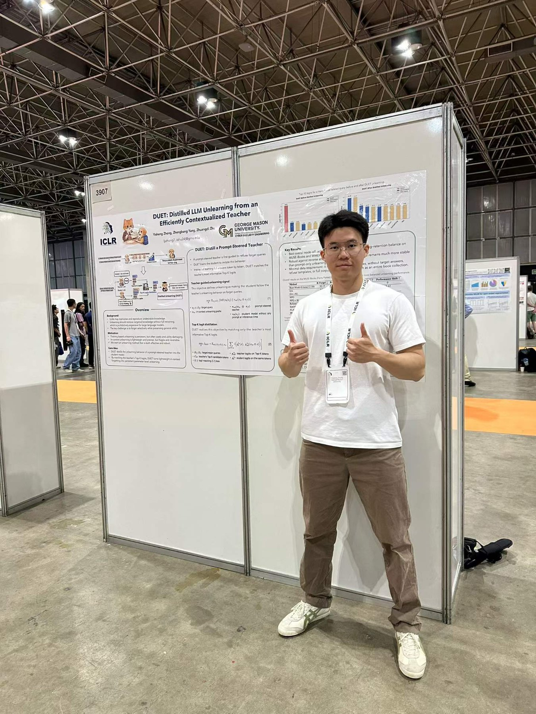

In April I flew to Rio de Janeiro, Brazil for the **Fourteenth International Conference on Learning Representations (ICLR 2026)**, where I presented our paper **"DUET: Distilled LLM Unlearning from an Efficiently Contextualized Teacher"** at the poster session.

Standing next to the poster for a full session turned out to be the most useful part of the trip. The questions I received — on how the prompt-steered teacher behaves under adversarial probing, on why Top-K logit matching is enough of a signal, and on what "forgetting" should even mean when we evaluate it — sharpened my own thinking more than another month of reading would have.

Beyond our own session, it was a privilege to meet so many researchers whose work I had only read, and to talk with people working on unlearning, alignment, and model safety from very different angles. I left with a long list of papers to read, a few concrete ideas for follow-up work, and a much better sense of where our line of research sits in the broader community.

🔗 [Read the paper](https://openreview.net/pdf?id=Xa6QRrXrKX)
