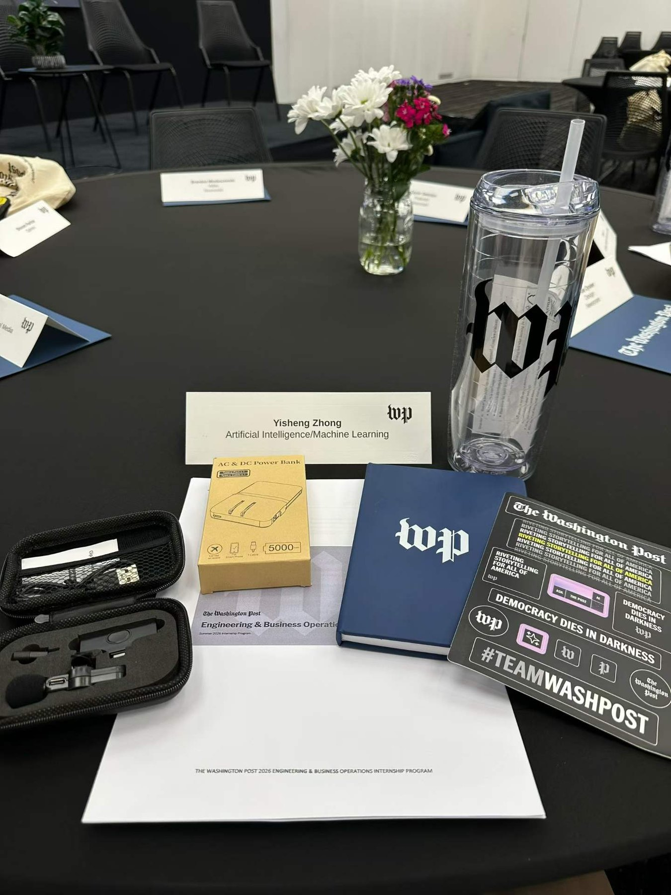
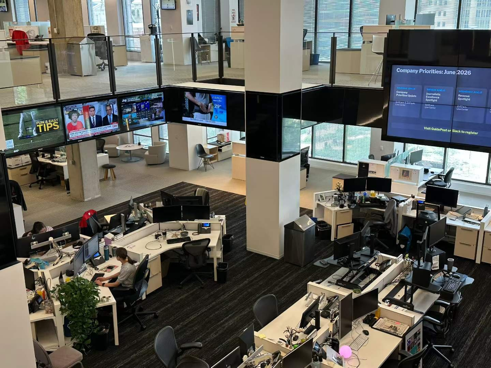

This summer I joined the **AI team at The Washington Post** in Washington, D.C., as part of the *2026 Engineering & Business Operations Internship Program*.

My project was an **LLM-assisted representation framework for personalized news recommendation**. Recommenders typically identify content by article-level IDs or coarse topic labels, which throws away most of what actually makes a story what it is. We introduced **StoryID** — a representation that captures the underlying story, the entities involved, and the intent of an article — and integrated it with existing recommendation models. The evaluation focused on the places where richer representations should pay off: cold-start recommendation, content diversity, and interpretability of why something was recommended.

Working inside a newsroom gave me a different view of the problems I study. In research I get to choose the benchmark; here the constraints came from real editorial workflows, real latency budgets, and a real bar for accuracy — where a plausible-but-wrong output is not a metric regression but a credibility cost.

I'm grateful to my team and mentors for their guidance, and to the other interns for making the summer as much fun as it was instructive. It was a good reminder of why the questions in my research — what a model retains, what it should be able to forget, and how confidently it should speak — matter well beyond the paper.
